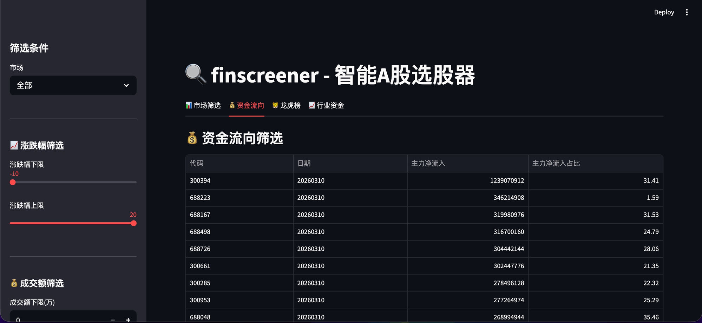
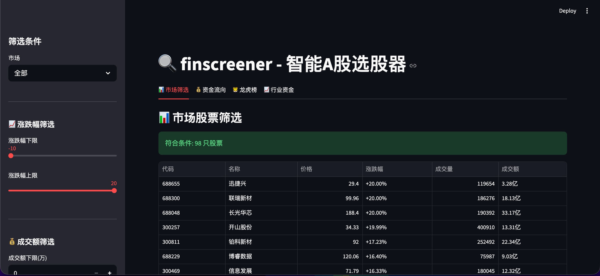
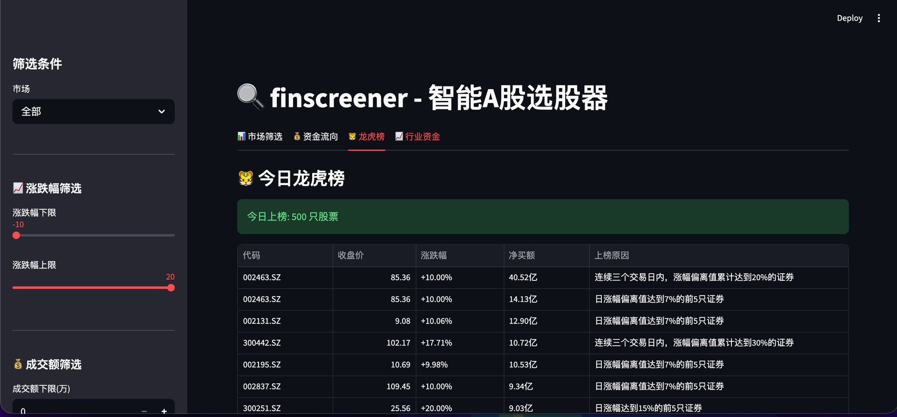
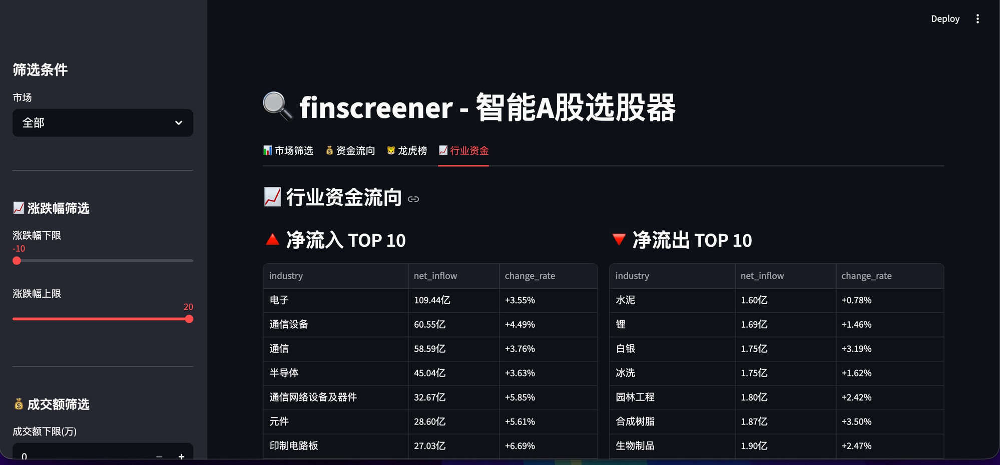

# finscreener

智能A股选股器 | 基于 Streamlit + Finshare

## 功能特性

- 📊 **市场筛选** - 涨跌幅、成交额、换手率
- 💰 **资金流向** - 主力净流入、行业资金
- 🐯 **龙虎榜** - 净买额排行、上榜原因
- 📈 **行业资金** - 资金流入流出分布

## 预览

### 市场筛选


### 资金流向


### 龙虎榜


### 行业资金


## 安装

```bash
git clone https://github.com/finvfamily/finscreener.git
cd finscreener
pip install -r requirements.txt
streamlit run app.py
```

## 使用

```bash
streamlit run app.py
```

然后在浏览器中打开 http://localhost:8501

## 技术栈

- **前端**: Streamlit
- **数据**: [Finshare](https://github.com/finvfamily/finshare)
- **图表**: Plotly

## Star 支持

⭐ Star 支持一下！

[](https://github.com/finvfamily/finscreener)

---

**基于 [Finshare](https://github.com/finvfamily/finshare)** - 免费的A股数据获取库
